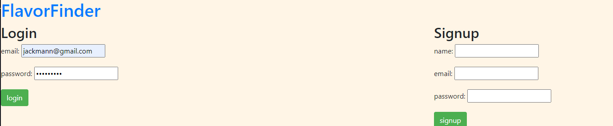

# FlavorFinder

## Description

FlavorFinder is a web application that allows users to discover recipes based on their preferred cuisine. The application utilizes an API to fetch recipe data and showcases it on the webpage. Users can select their desired cuisine type to view a curated list of recipes.

## Screenshots

## Deployment

The application is deployed and accessible online. You can visit it by clicking the following link: [FlavorFinder App](https://dry-waters-69396-c33e43ba5835.herokuapp.com/)
